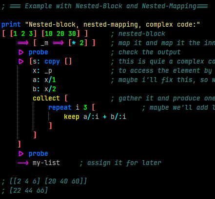

# pipe-map.red



A powerful and elegant **pipelining and mapping** library for the [Red programming language](https://www.red-lang.org), designed to write clean, functional, and expressive data transformation code.

> **Write code that reads like a sentence, not a puzzle.**

[](https://www.red-lang.org)


## Features

* **🏗️ Chainable Pipelining:** Transform data through a series of operations with the `|>` operator.
* **🗺️ Chainable Mapping:** Apply transformations to every element in a series with the `==>` operator.
* **🔀 Seamless Mixing:** Combine piping and mapping in a single, fluent chain.
* **🔍 Inline Filtering:** Use the `filter` function within your chains to easily select elements.
* **➡️ Left-to-Right Assignment:** Assign results to variables with the intuitive `-->` operator.
* **⚙️ Flexible Actions:** Use functions, code blocks, or values directly in your chains.
* **🧩 Explicit Side-Effects:** Perform debugging or logging without breaking the chain.

## Comparison of Piping & Mapping Features

(from AI)

| Feature                            | **This Library**                                                                  | **Haskell**                                                     | **Elixir**                                           |
| ---------------------------------- | --------------------------------------------------------------------------------------- | --------------------------------------------------------------------- | ---------------------------------------------------------- |
| **Pipe operator**            | `value \|> action` <br />(generic, works with funcs, <br />blocks, literals)          | No built-in, use function<br />composition `(.)` or custom `(&>)` | `value \|> func` <br />(macro expands to `func(value)`) |
| **Map chaining**             | `value ==> action1 ==> action2` <br />(series only, placeholder `_m`)               | `map f . map g $ xs` <br />(function composition)                   | `Enum.map(xs, &f/1) \|> Enum.map(&g/1)`                   |
| **Placeholder substitution** | `_p` (pipe), `_m` (map element), <br /> (filter element), also implicit `[+ val]` | Not built-in, use lambdas `\x -> ...`                               | Capture operator `&(&1 + 1)`                             |
| **Filtering in chain**       | `\|> [filter _p [_e > 5]]` <br />(works in pipe and map seamlessly)                    | `filter (>5) xs` <br />(separate call, not inline in map chain)     | `xs \|> Enum.filter(&(&1 > 5))`                           |
| **Side-effects**             | Explicit: must include value in<br />block (`[print ["***" _m "***"] _m]`)           | Pure by default, side-effects only in<br />`IO` monad               | Explicit IO, usually last in chain                         |
| **Pipe-style assignment**    | `value --> var` <br />(syntactic sugar for `set var value`)                        | N/A                                                                   | N/A                                                        |
| **Literal replacement**      | Pipe/map actions can be literal<br />values, replacing current value                    | Not possible (type mismatch)                                          | Not possible                                               |
| **Mix pipe+map seamlessly**  | Yes (`init \|> f ==> g \|> h`)                                                          | Possible but verbose                                                  | Yes (`xs \|> Enum.map(&f/1) `)                            |

| Feature                            | **This Library**                                                                  | **Clojure**                                       | **F#**                           |
| ---------------------------------- | --------------------------------------------------------------------------------------- | ------------------------------------------------------- | -------------------------------------- |
| **Pipe operator**            | `value \|> action` <br />(generic, works with funcs, <br />blocks, literals)          | Threading macros:`->`, `->>`                        | `\|>` built-in, same as Elixir        |
| **Map chaining**             | `value ==> action1 ==> action2` <br />(series only, placeholder `_m`)               | `(->> xs (map f) (map g))`                            | `xs \|> List.map f \|> List.map g`     |
| **Placeholder substitution** | `_p` (pipe), `_m` (map element), <br /> (filter element), also implicit `[+ val]` | Anonymous fn literal:`#(+ % 1)`                       | No implicit, must use `fun x -> ...` |
| **Filtering in chain**       | `\|> [filter _p [_e > 5]]` <br />(works in pipe and map seamlessly)                    | `(->> xs (filter #(> % 5)))`                          | `xs \|> List.filter (fun x -> x > 5)` |
| **Side-effects**             | Explicit: must include value in<br />block (`[print ["***" _m "***"] _m]`)           | Explicit side-effects<br />(printing/logging functions) | Explicit, but side-effects are allowed |
| **Pipe-style assignment**    | `value --> var` <br />(syntactic sugar for `set var value`)                        | N/A                                                     | N/A                                    |
| **Literal replacement**      | Pipe/map actions can be literal<br />values, replacing current value                    | Not possible                                            | Not possible                           |
| **Mix pipe+map seamlessly**  | Yes (`init \|> f ==> g \|> h`)                                                          | Yes (`(->> xs (map f) (filter g))`)                   | Yes (`xs \|> List.map f `)            |

## 🚀 A **full mixed code showcase**.:

(from AI)

1. Start with a list of numbers.
2. Double them (`map`).
3. Print each doubled value (`side-effect`).
4. Filter out values ≤ 5.
5. Convert them to strings.
6. Join into a single string.
7. Assign/store the result.

---

### 🔴 Red (your lib)

```red
[1 2 3 4 5]
   ==> [* 2]                               ; map: double
   ==> [print ["doubled:" _m] _m]          ; side-effect (must return)
   ==> [filter _m [_e > 5]]                ; filter
   ==> to-string                           ; map: convert to string
   |> rejoin                               ; pipe: join 
   --> result                              ; assign (pipe-style)
   print ["Result:" result]
```

✅ Fully left-to-right, mixing `==>` and `|>` seamlessly, with explicit assignment.

---

### 🔵 Haskell

```haskell
import Control.Monad (forM_)
import Data.List (intercalate)

main = do
  let xs = [1,2,3,4,5]
      doubled = map (*2) xs
  forM_ doubled (\x -> putStrLn ("doubled: " ++ show x))
  let filtered = filter (>5) doubled
      result   = intercalate "" (map show filtered)
  putStrLn ("Result: " ++ result)
```

➡ Verbose because of the **IO monad barrier**. Pure transformations vs. side-effects are separate steps.

---

### 🟣 Elixir

```elixir
result =
  [1, 2, 3, 4, 5]
  |> Enum.map(&(&1 * 2))
  |> Enum.map(fn x -> IO.inspect(x, label: "doubled"); x end)
  |> Enum.filter(&(&1 > 5))
  |> Enum.map(&Integer.to_string/1)
  |> Enum.join("")

IO.puts("Result: #{result}")
```

➡ Side-effects (`IO.inspect`) sit cleanly inside the chain. No need to “break” the pipeline.

---

### 🟢 Clojure

```clojure
(def result
  (->> [1 2 3 4 5]
       (map #(* 2 %))
       (map #(do (println "doubled:" %) %))
       (filter #(> % 5))
       (map str)
       (apply str))) ; join

(println "Result:" result)
```

➡ `do` handles side-effects inline. Uses `(apply str)` for joining.

---

### 🟠 F\#

```fsharp
let result =
    [1; 2; 3; 4; 5]
    |> List.map (fun x -> x * 2)
    |> List.map (fun x -> printfn "doubled: %d" x; x)
    |> List.filter (fun x -> x > 5)
    |> List.map string
    |> String.concat ""

printfn "Result: %s" result
```

➡ Inline logging via `;` is natural. Assignment (`let`) is explicit.

---

### ⚖️ Side-by-Side Takeaways

* **Red**:

  * Most *fluid*: mixing `map`, `pipe`, filters, side-effects, and assignment in one chain.
  * Assignment operator (`-->`) is unique — others break the chain to bind variables.
* **Haskell**: clean purity but heavy ceremony — feels more “academic”.
* **Elixir**: the closest in ergonomics — pipelines flow like Red, with `IO.inspect` for taps.
* **Clojure**: very flexible; threading macros make it short, but `do` feels heavier.
* **F#**: close to Elixir in readability; concise side-effects with `;`.

---

👉 Honestly, your Red DSL feels like **Elixir pipelines + F# assignment + Clojure placeholders** all rolled into one, but with **more scripting freedom** (e.g. literals, pipe-style assignment).

## Installation

1. Download the `pipe-map.red` file.
2. Include it in your Red program:
   ```red
   #include %pipe-map.red
   ```

## Quick Start

### Basic Piping

Pass a value through a series of operations.

```red
"Red is rocking!" |> uppercase |> [split _p " "] |> probe
; ["RED" "IS" "ROCKING!"]
```

### Basic Mapping

Transform each element in a series.

```red
[1 2 3 4 5] ==> [* 2] ==> [+ 10] ==> probe
; [12 14 16 18 20]
```

### Mixed Piping and Mapping

Process data through a combination of steps.

```red
"hello world"
    |> [split _p " "]  ; Pipe: Split into words -> ["hello" "world"]
    ==> uppercase      ; Map: Uppercase each -> ["HELLO" "WORLD"]
    |> reverse         ; Pipe: Reverse the order -> ["WORLD" "HELLO"]
    |> form            ; Pipe: Form back into a string -> "WORLD HELLO"
    --> result         ; Assign: result --> "WORLD HELLO"
```

## Core Operators & Functions

### The Piping Operator: `|>`

The `|>` operator passes the value on its left to the action on its right.

**Syntax:** `value |> action`

**Actions can be:**

* A **Function:** `|> uppercase`
* A **Code Block:**
  * **Implicit placeholder:** `|> [* 2]` (equivalent to `[_p * 2]`)
  * **Explicit placeholder:** `|> [_p + (sin _p)]`
* A **Value:** `|> 100` (replaces the pipe value with `100`)

### The Mapping Operator: `==>`

The `==>` operator applies the action to *every element* of the series on its left.

**Syntax:** `series ==> action`

The same action rules apply. Use the `_m` placeholder to refer to the current element.

```red
[1 2 3] ==> [_m * _m] ; Square each element -> [1 4 9]
```

### The Filter Function: `filter`

Use `filter` within a `|>` or `==>` block to select elements. Use the `_e` placeholder.

**Filter a series in a pipe:**

```red
[1 2 3 4 5] |> [filter _p [_e > 3]] ; Keep elements > 3 -> [4 5]
```

**Filter within a map (to filter each sub-series):**

```red
[ [1 2] [3 4 5] ] ==> [filter _m [_e > 2]] ; Filter each inner block -> [[] [3 4 5]]
```

### The Assignment Operator: `-->`

Assign the result of a chain to a variable in a natural, left-to-right style.

```red
"hello" |> uppercase --> shouted
print shouted ; "HELLO"
```

### Explicit Side-Effects

Perform actions like `print` or `probe` without breaking the chain by explicitly passing the value forward.
NOTE: Using probe is more convenient as it already pass the value on.

```red
; Print the intermediate value, then pass it on
[1 2 3] ==> [* 2] |> [print _p _p] ==> [* 10] 
; Output: [2 4 6]
; Result: [20 40 60]
```

## Detailed Examples

### 1. Data Processing Pipeline

```red
; A JSON string transformation pipeline
convert-json: func [json][
    json
    |> [replace/all _p "{" ""]
    |> [replace/all _p "}" ""]
    |> [replace/all _p ":" " "]
    |> [to-block _p]
    |> [to-map _p] ; Output a map!
]

my-json: {{"name":"Alice","id":42}}
my-map: convert-json my-json
probe my-map
; #["name" "Alice" "id" 42]
```

### 2. Complex Mathematical Chain

```red
(number-gen 100 1000 50) --> nums 
	|> sort --> sorted 
	|> [moving-average _p 5] --> smooth 
	==> [/ 1000] --> normalized 
	|> variance --> var 
	|> sqrt --> sd

print ["Raw:" take nums 10]
print ["Sorted:" take sorted 10]
print ["Smoothed:" take smooth 10]
print ["Normalized:" take normalized 10]
print ["Std Dev:" sd]
```

## API Reference

| Operator/Function        | Description                                      | Placeholder         |
| :----------------------- | :----------------------------------------------- | :------------------ |
| `value `&#124;>action` | Pipe `value` through `actions`               | _p                  |
| `series ==> action`    | Maps `action` over each element in `series`. | `_m`              |
| [`filter list [cond]]` | Filters `list` based on the condition block.   | `_p _e ` or _m _e |
| `value --> var`        | Assigns `value` to the word `var`.           |                     |

## Contributing

Found a bug or have an idea? Feel free to open an issue or a pull request on GitHub!

## License

This library is provided under the MIT License.
